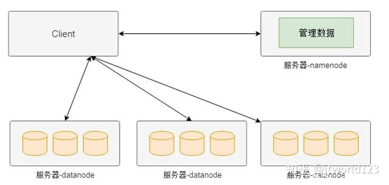
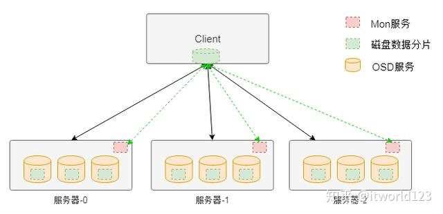
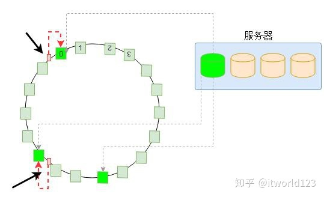
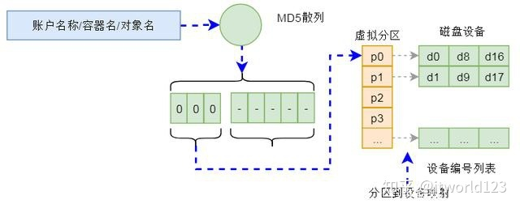

# 分布式存储

> 部分内容摘自 [知乎：一篇文章讲透分布式存储](https://zhuanlan.zhihu.com/p/55964292)

## 回顾集中式存储

在集中式存储中通常包含一个机头，这个是存储系统中最为核心的部件。通常在机头中有包含两个控制器，这两个控制器实现互备的作用，避免硬件故障导致整个存储系统的不可用。

## 分布式存储框架

中间控制节点架构（HDFS）

完全无中心架构---计算模式（Ceph）

完全无中心架构---一致性哈希（Swift）

### 中间控制节点架构（HDFS）

分布式存储最早是由谷歌提出的，其目的是通过廉价的服务器来提供使用与大规模，高并发场景下的Web访问问题。如图3是谷歌分布式存储（HDFS）的简化的模型。在该系统的整个架构中将服务器分为两种类型，一种名为namenode，这种类型的节点负责管理管理数据（元数据），另外一种名为datanode，这种类型的服务器负责实际数据的管理。

上图分布式存储中，如果客户端需要从某个文件读取数据，首先从namenode获取该文件的位置（具体在哪个datanode），然后从该位置获取具体的数据。在该架构中namenode通常是主备部署，而datanode则是由大量节点构成一个集群。由于元数据的访问频度和访问量相对数据都要小很多，因此namenode通常不会成为性能瓶颈，而datanode集群可以分散客户端的请求。因此，通过这种分布式存储架构可以通过横向扩展datanode的数量来增加承载能力，也即实现了动态横向扩展的能力。

### 完全无中心架构---计算模式（Ceph）

如图是Ceph存储系统的架构，在该架构中与HDFS不同的地方在于该架构中没有中心节点。客户端是通过一个设备映射关系**计算出来**其写入数据的位置，这样客户端可以直接与存储节点通信，从而避免中心节点的性能瓶颈。

在Ceph存储系统架构中核心组件有Mon服务、OSD服务和MDS服务等。对于块存储类型只需要Mon服务、OSD服务和客户端的软件即可。其中Mon服务用于维护存储系统的硬件逻辑关系，主要是服务器和硬盘等在线信息。Mon服务通过集群的方式保证其服务的可用性。OSD服务用于实现对磁盘的管理，实现真正的数据读写，通常一个磁盘对应一个OSD服务。
客户端访问存储的大致流程是，客户端在启动后会首先从Mon服务拉取存储资源布局信息，然后根据该布局信息和写入数据的名称等信息计算出期望数据的位置（包含具体的物理服务器信息和磁盘信息），然后该位置信息直接通信，读取或者写入数据。

### 完全无中心架构---一致性哈希（Swift）

与Ceph的通过计算方式获得数据位置的方式不同，另外一种方式是通过一致性哈希的方式获得数据位置。一致性哈希的方式就是将设备做成一个哈希环，然后根据数据名称计算出的哈希值映射到哈希环的某个位置，从而实现数据的定位。

如图5是一致性哈希的基本原理，为了绘制简单，本文以一个服务器上的一个磁盘为例进行介绍。为了保证数据分配的均匀性及出现设备故障时数据迁移的均匀性，一致性哈希将磁盘划分为比较多的虚拟分区，每个虚拟分区是哈希环上的一个节点。整个环是一个从0到32位最大值的一个区间，并且首尾相接。当计算出数据（或者数据名称）的哈希值后，必然落到哈希环的某个区间，然后以顺时针，必然能够找到一个节点。那么，这个节点就是存储数据的位置。
Swift存储的整个数据定位算法就是基于上述一致性哈希实现的。在Swift对象存储中，通过账户名/容器名/对象名三个名称组成一个位置的标识，通过该唯一标识可以计算出一个整型数来。而在存储设备方面，Swift构建一个虚拟分区表，表的大小在创建集群是确定（通常为几十万），这个表其实就是一个数组。这样，根据上面计算的整数值，以及这个数组，通过一致性哈希算法就可以确定该整数在数组的位置。而数组中的每项内容是数据3个副本（也可以是其它副本数量）的设备信息（包含服务器和磁盘等信息）。也就是经过上述计算，可以确定一个数据存储的具体位置。这样，Swift就可以将请求重新定向到该设备进行处理。

上述计算过程是在一个名为Proxy的服务中进行的，该服务可以集群化部署。因此可以分摊请求的负载，不会成为性能瓶颈。