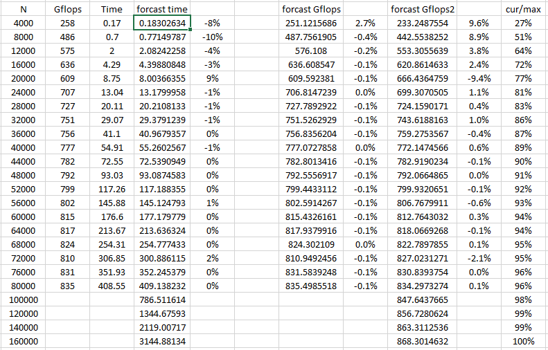
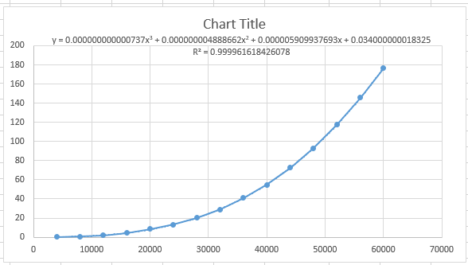
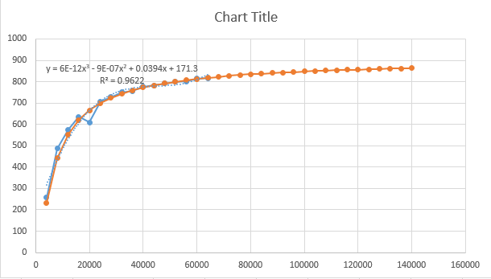
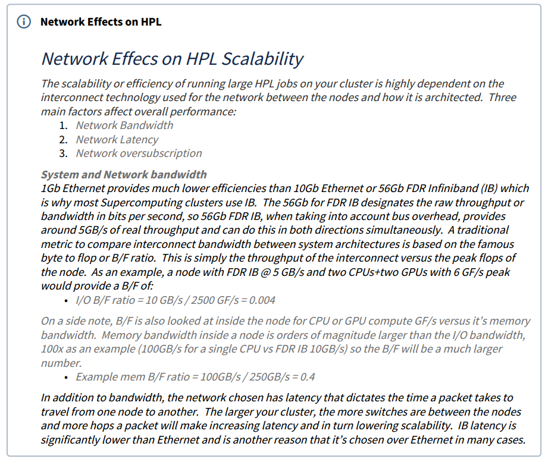
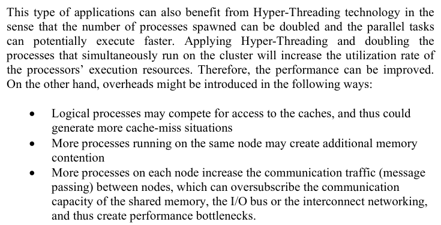
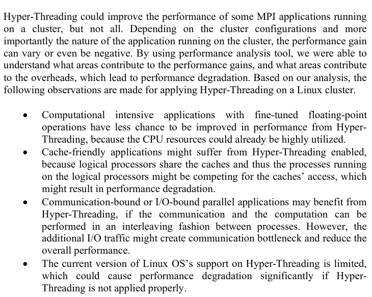

# HPL & HPCG Instruction


## 1. Test Platform

* Server from LC AIStation, owned by Huangkai.  `Website: 10.26.1.57:32206`

    * ```bash
        Device: V100
        User: nclab
    Passwd: 123456a?
        ```
    
    * ```bash
        Device: 2080Ti
        User: nclab_2080Ti
    Passwd: 123456a?
        ```
        
    * ```bash
        After creating new container, add the following line to /etc/resolv.conf
        nameserver 10.20.221.253
        nameserver 8.8.8.8
        nameserver 1.1.1.1
        nameserver 223.5.5.5
        ```
    
        
    
* Server from our office

    * ```bash
        Host node1
            Hostname 10.21.38.17
            User cscg_compute
        ```
        
    * ```bash
        Host node2
            Hostname 10.21.38.22
            User cscg_compute
        ```
    


## 2. Test Software

* HPL
    * Official HPL
    * Intel HPL
    * CUDA HPL
* HPCG
    * Official HPCG
    * Intel HPCG
    * CUDA HPCG


## 3. Available Resources

* `Teams/General/AP-collection/hpl/`

    * ```bash
        README.md
        Make.linux-guide.md
        Intel-MPI-MKL-Installation_Guide.md
        HPL-CUDA.md
        benchmark/1.hpl-cuda-...
        ```

* `Teams/General/AP-collection/hpcg/`

    * ```bash
        README.md
        HPCG-CUDA.md
        benchmark/1.hpcg-cuda-...
        ```

* `10.21.38.17:/home/cscg_compute/Resource/`

    * ```bash
        install.sh
        ```


## 4. TODO

```bash
1. Test and compare Intel HPL with Official HPL
2. Test and compare Intel HPCG with Official HPCG

3. Improve Tesla V100 HPL-CUDA to 5000+ Gflops (Current 1554)
4. Improve Tesla V100 HPCG-CUDA to 154/145 Gflops (Current 127/100 or 116/110)

5. Figure out the meaning of HPCG result
6. Figure out how HPL work
7. Figure out how HPL-CUDA work
8. Figure out how HPCG work
9. Figure out how HPCG-CUDA work

10. Use different MPI and blas to test HPL
11. Use different MPI and blas to test HPL-CUDA 
12. Use different MPI and blas to test HPCG
13. Use different config to test HPL
14. Use different config to test HPL-CUDA
15. Use different config to test HPCG
16. Use different config to test HPCG-CUDA

17. Figure out the relationship between performance and number of CPU/GPU in HPL-CUDA
```

```bash
0. Read through these documents to find out better way to improve HPL & HPCG
```

1. https://community.arm.com/developer/tools-software/hpc/b/hpc-blog/posts/profiling-and-tuning-linpack-step-step-guide

2. https://www.reddit.com/r/CUDA/comments/7qrigm/cuda_accelerated_linpack_benchmark_seemingly_not/

3. https://devtalk.nvidia.com/default/topic/991058/poor-results-from-cuda-linpack-on-k80/

4. [A another obsolete version of HPL-CUDA](https://github.com/davidrohr/hpl-gpu)

5. http://hpl-calculator.sourceforge.net/Howto-HPL-GPU.pdf

6. https://dl.acm.org/doi/pdf/10.1145/1513895.1513901?download=true

7. https://yylin1.github.io/2018/10/23/build-hpl-gpu/

8. [linpack explain](http://www.netlib.org/utk/people/JackDongarra/SLIDES/isc-talk-06102.pdf)

9. [nvidia](https://pdfs.semanticscholar.org/2a14/2e446829e8ad75addcb228ffcca53792d880.pdf)

10. [paper: Tesla C1060 HPL test result](https://core.ac.uk/download/pdf/147690833.pdf)

11. [yumpu: Tesla T10, T20 HPL test result](https://www.yumpu.com/en/document/view/24836553/cuda-accelerated-linpack-on-clusters-nvidia)

12. [forum: Tesla V100 HPL test result ***](https://forums.servethehome.com/index.php?threads/tesla-v100-x-8-linpack-testing-on-sys-4028gr-txrt.16913/)

    * Amazing performance, 5300 GFlops. Ask it for its HPL-CUDA.

13. [forum: Tesla P100 HPL test result](https://forums.servethehome.com/index.php?threads/tesla-p100-x-8-linpack-testing-on-sys-4028gr-txrt.17148/)

14. [nvidia pdf: CUDA Accelerated Linpack on Clusters, Tesla M2050 test result ***](https://www.nvidia.com/content/PDF/sc_2010/theater/Phillips_SC10.pdf)

    > 2011-born Fermi-based Tesla M2050 has theoretical 515 peak GFlops, and achieves 350 GFlops in `hpl-2.0_FERMI_v15`, of 68% efficiency.

    * Nowadays, Tesla V100 has 7000 peak GFlops, and achieves 656 GFlops, of 9.4% efficiency.

15. [gist: V100 HPL test result ***](https://gist.github.com/shibacow/860f89f2b0f3cc5b30e64a97bc1d79e0)

    * 1.307e+03 GFlops. 1307 GFlops. Little targets.

16. https://www.nvidia.com/content/dam/en-zz/Solutions/Data-Center/tesla-product-literature/v100-application-performance-guide.pdf
17. https://www.dell.com/support/article/us/en/04/sln316570/hpc-applications-performance-with-turing?lang=en
    
    * 4756 GFlops, another targets.
18. [detail SCC report on HPL/HPCG! *** # page 26, page76, wonderful wonderful story](https://static.epcc.ed.ac.uk/dissertations/hpc-msc/2017-2018/Wilson_Lisan-B109784_dissertation_SCC_ver4.pdf)
    
    * 5000 GFlops for HPL. 140 GFflops for HPCG. 


## Gflops forcast





Time vs N




Gflops vs N


It seems like the time to solve the HPL is 3-degree polynomial to the problem size N

```bash
time = a*N^3 + b*N^2 + c*N + d
```

And the computation complexity is also 3-degree polynomial to N:

```bash
Gflops = (N/1e9)*(N/time)*(2/3*N+3/2)
```

Combining this two, we have

```bash
(N/1e9)*(N/a*N^3 + b*N^2 + c*N + d)*(2/3*N+3/2)
```

or

```bash
(a1*N^3 + b1*N^2 + c1*N + d1)
-----------------------------
(a2*N^3 + b2*N^2 + c2*N + d2)

so as N -> ∞, Gflops → a1/a2
```


Basically we have

```bash
N=16000, ratio = 70%
N=24000, ratio = 80%
N=44000, ratio = 90%
N=68000, ratio = 95%
```


To find opt NB, 32 interval is good, basically, from 128 to 256

When N get larger, opt NB may increase one interval


```python
def get_computation(N):
    return (N/1e9) * (N) * (2/3*N + 3/2)

def get_Gflops(N,t):
    return get_computation(N) / t

def get_Gflops_forcast(N, regression_N2t_function):
    t_forcast = regression_N2t(N)
    return get_Gflops(N, t_forcast)

import numpy
import matplotlib.pyplot as plt

N = [20000, 40000, 60000, 80000, 100000, 120000, 140000]
t = [7.78, 54.83, 173.13, 410.73, 769.48, 1320.53, 2098.19]

Gflops = []
for i in range( len(N) ):
    Gflops.append( get_Gflops(N[i], t[i]) )

regression_N2t = numpy.poly1d(numpy.polyfit(N, t, 3))
N_line = numpy.linspace(0, 200000, 200)
Gflops_forcast = get_Gflops_forcast(N_line, regression_N2t)

print( get_Gflops_forcast(100000, regression_N2t) )


t_forcast = regression_N2t(N_line)

plt.scatter(N, t)
plt.scatter(N, Gflops)
plt.plot(N_line, t_forcast)
plt.plot(N_line, Gflops_forcast)
plt.show(
```


## How to test HPL

(After compiling the HPL)

1. Get the approximate Rmax by prerun the test.

2. Calculate the appropriate N for different test time {10s, 60s, 30min}

    > (When Rmax is around 900)
    >
    > 10s ≈ 80% Rmax
    >
    > 60s ≈ 90% Rmax
    >
    > 1800s ≈ 99% Rmax

    ```bash
    Gflops = 900
    t_s = 10
    # t_s * Gflops ≈ (N/1e9) * (N) * (2/3*N)
    N = (Gflops * t_s * 1e9 * 3/2)**(1/3)
    print(N)
    ```

3. Test different combination of P×Q under 10s condition, then select the best choice

    ```bash
    3            # of process grids (P x Q)
    1  2  4           Ps
    20 10 5          Qs
    ```

4. Test different NB under 10s condition, record the best choice

    ```bash
    15            # of NBs
    64 96 128 160 192 224 256 288 320 352 384 416 448 480 512          NBs (64-512, 32 interval)
    ```

5. Test 5 NB (16 interval) around the best choice under 60s condition, select the best choice

    ```bash
    5				# of NBs 
    128 144 160 176 192		NBs (16 interval)
    ```

6. Test the result under 30min condition, now we get a valid Rmax

7. Test the result under max time condition, now we get a final Rmax


## GPU Benchmark other than HPL-GPU

[Dell: HPC applications performance with turing](https://www.dell.com/support/article/zh-hk/sln316570/hpc-applications-performance-with-turing?lang=en)





## Hyperthreading

Hyperthreading only slow down the HPL.

Generally, HT is disabled in HPC cluster.

https://software.intel.com/zh-cn/comment/1761670

https://www.reddit.com/r/HPC/comments/69q66n/dual_core_hyperthreading_and_hpc/

https://www.pugetsystems.com/labs/hpc/Hyper-Threading-may-be-Killing-your-Parallel-Performance-578/

https://www.golinuxhub.com/2018/05/how-to-disable-or-enable-hyper/

https://www.intel.com/content/dam/www/public/us/en/documents/presentation/hpc-clusters-best-practices-performance-study.pdf

http://www.mmc.igeofcu.unam.mx/femp/Herramientas/ComputoParalelo/Herramientas-HPC/AnEmpiricalStudyOfHyperThreadingInHighPerformanceComputingCluster.pdf

> 
>
> 

https://www.dell.com/support/article/zh-hk/sln316864/bios-characterization-for-hpc-with-intel-cascade-lake-processors?lang=en

> **It is recommended that [Hyper-Threading be turned off ](https://downloads.dell.com/manuals/all-products/esuprt_software/esuprt_it_ops_datcentr_mgmt/high-computing-solution-resources_white-papers6_en-us.pdf)for general-purpose HPC clusters. Depending on the applications used, the benefit of this feature should be tested and enabled as appropriate.**


