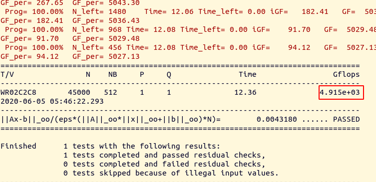

[nvidia: NVIDIA Developer Program - ComputeWorks exclusive downloads/CUDA Accelerated Linpack](https://developer.nvidia.com/computeworks-developer-exclusive-downloads)


### Testing Environment:

    Ubuntu 18.04.3 LTS, 4.18.0-15-generic, x86_64, VirtualBox, 2GB Memory, HPL 2.3


### 1. Installation

* Register and download HPL-CUDA from [nvidia: NVIDIA Developer Program - ComputeWorks exclusive downloads/CUDA Accelerated Linpack](https://developer.nvidia.com/computeworks-developer-exclusive-downloads)
* Install Intel® Parallel Studio XE for Linux following the instruction in `AP-Collection/hpl/Intel-MPI-MKL-Installation_Guide.md`


### 2. Config `Make.linux`

```bash
# Working File: hpl-2.0_FERMI_v15/Make.linux
# Modify `TOPdir` !!!

SHELL        = /bin/sh
CD           = cd
CP           = cp
LN_S         = ln -fs
MKDIR        = mkdir -p
RM           = /bin/rm -f
TOUCH        = touch
ARCH         = linux
ifndef  TOPdir
TOPdir = /home/levi/Desktop/ap-collection/test/hpl-2.0_FERMI_v15
endif
INCdir       = $(TOPdir)/include
BINdir       = $(TOPdir)/bin/$(ARCH)
LIBdir       = $(TOPdir)/lib/$(ARCH)
HPLlib       = $(LIBdir)/libhpl.a 

LAdir        = /opt/intel/mkl/lib/intel64
LAinc        =
LAlib        = -L $(TOPdir)/src/cuda  -ldgemm -L/usr/local/cuda/lib64 -lcuda -lcudart -lcublas -L$(LAdir) -lmkl_intel_lp64 -lmkl_intel_thread -lmkl_core -liomp5

F2CDEFS      = -DAdd__ -DF77_INTEGER=int -DStringSunStyle
HPL_INCLUDES = -I$(INCdir) -I$(INCdir)/$(ARCH) $(LAinc) $(MPinc) -I/usr/local/cuda/include

HPL_LIBS     = $(HPLlib) $(LAlib) $(MPlib)
HPL_OPTS     =  -DCUDA
HPL_DEFS     = $(F2CDEFS) $(HPL_OPTS) $(HPL_INCLUDES)

CC      = mpicc
CCFLAGS = $(HPL_DEFS) -fomit-frame-pointer -O3 -funroll-loops -W -Wall -fopenmp
CCNOOPT      = $(HPL_DEFS) -O0 -w
LINKER       = $(CC)
LINKFLAGS    = $(CCFLAGS) 
ARCHIVER     = ar
ARFLAGS      = r
RANLIB       = echo
MAKE = make TOPdir=$(TOPdir)
```


### 3. Make

```bash
# Working Dir: hpl-2.0_FERMI_v15/
make arch=linux
```

#### 3.1 ReMake

```bash
make arch=linux clean_arch_all ; make arch=linux
```

* Do not use `-j $(nproc)`


### 4. Config `run_linpack`

```bash
# Working File: hpl-2.0_FERMI_v15/bin/linux/run_linpack
# Modify `HPL_DIR` !!!
```

```bash
#!/bin/bash

#location of HPL 
HPL_DIR=/root/levi/modified/hpl-cuda

# Number of CPU cores ( per GPU used = per MPI process )
CPU_CORES_PER_GPU=4
# Number of GPU 
export CUDA_VISIBLE_DEVICES=0

export MKL_NUM_THREADS=$CPU_CORES_PER_GPU
export GOTO_NUM_THREADS=$CPU_CORES_PER_GPU
export OMP_NUM_THREADS=$CPU_CORES_PER_GPU

export MKL_DYNAMIC=FALSE

# Balance workload between CPU and GPU
export CUDA_DGEMM_SPLIT=1.0
export CUDA_DTRSM_SPLIT=1.0

export LD_LIBRARY_PATH=$HPL_DIR/src/cuda:$LD_LIBRARY_PATH

# -np should be GPU number
# /usr/bin/time -p mpirun -np 1 $HPL_DIR/bin/linux-cuda/xhpl 2>&1 | tee -a result
taskset --cpu-list 0-$CPU_CORES_PER_GPU /usr/bin/time -p mpirun -np 1 $HPL_DIR/bin/linux-cuda/xhpl 2>&1 | tee -a result
# nice -n -19 taskset --cpu-list 0-$CPU_CORES_PER_GPU /usr/bin/time -p mpirun -np 1 $HPL_DIR/bin/linux-cuda/xhpl 2>&1 | tee -a result
```


### 5. Config `HPL.dat`

```bash
# Working File: hpl-2.0_FERMI_v15/bin/linuxCUDA/HPL.dat
```

```bash
HPLinpack benchmark input file
Innovative Computing Laboratory, University of Tennessee
HPL.out      output file name (if any)
6            device out (6=stdout,7=stderr,file)
1            # of problems sizes (N)
25000        Ns
1            # of NBs
1024          NBs
0            PMAP process mapping (0=Row-,1=Column-major)
1            # of process grids (P x Q)
1            Ps
1            Qs
16.0         threshold
1            # of panel fact
1            PFACTs (0=left, 1=Crout, 2=Right)
1            # of recursive stopping criterium
8            NBMINs (>= 1)
1            # of panels in recursion
2            NDIVs
1            # of recursive panel fact.
1            RFACTs (0=left, 1=Crout, 2=Right)
1            # of broadcast
2            BCASTs (0=1rg,1=1rM,2=2rg,3=2rM,4=Lng,5=LnM)
1            # of lookahead depth
0            DEPTHs (>=0)
0            SWAP (0=bin-exch,1=long,2=mix)
192           swapping threshold
1            L1 in (0=transposed,1=no-transposed) form
0            U  in (0=transposed,1=no-transposed) form
1            Equilibration (0=no,1=yes)
8            memory alignment in double (> 0)
```


### 6. Run

```bash
./run_linpack
```


### 7. Performance

* The performance of `HPL-CUDA` depends on both `CPU_CORES_PER_GPU` and `GPU`. 


### 7.1 Statistic

```bash
# HPL-CUDA, CPU_CORES_PER_GPU=1, may not be accurate since CPU performance is uncontrol
# The highest performance measured
GeForce RTX 1050 Ti (mobile) = 88 Gflops
GeForce RTX 2080 Ti = 326 Gflops
```


## 7.2 Experience

1. Peak = GPU-Peak + CPU-Peak, perf = gpu-perf + cpu-perf
2. The marginal perf of adding cpu is decreasing. `4 cpu` is most efficient.
3. Adding  cpu can increase gpu-perf ? Because adding 1 cpu in V100 can increase 285 GFlops, adding 1 same cpu in 2080ti can increase 62 GFlops. The perf of the cpu is only ~50 GFlops.
4. When N is larger, maxarg(NB) will be larger


### 7.2 Cruel Performance of Tesla series on `hpl-2.0_FERMI_v15`

> The best HPL performance will come from HPL code specifically provided on a case-by-case basis by NVIDIA. It is not publicly available, and the `hpl-2.0_FERMI_v15` will not achieve highest performance on GPUs newer than FERMI.

[](https://www.reddit.com/r/CUDA/comments/7qrigm/cuda_accelerated_linpack_benchmark_seemingly_not/)

[](https://devtalk.nvidia.com/default/topic/991058/poor-results-from-cuda-linpack-on-k80/)

[A another obsolete version of HPL-CUDA](https://github.com/davidrohr/hpl-gpu)

http://hpl-calculator.sourceforge.net/Howto-HPL-GPU.pdf

https://dl.acm.org/doi/pdf/10.1145/1513895.1513901?download=true

https://yylin1.github.io/2018/10/23/build-hpl-gpu/

[linpack explain](http://www.netlib.org/utk/people/JackDongarra/SLIDES/isc-talk-06102.pdf)

[nvidia](https://pdfs.semanticscholar.org/2a14/2e446829e8ad75addcb228ffcca53792d880.pdf)


[paper: Tesla C1060 HPL test result](https://core.ac.uk/download/pdf/147690833.pdf)

[yumpu: Tesla T10, T20 HPL test result](https://www.yumpu.com/en/document/view/24836553/cuda-accelerated-linpack-on-clusters-nvidia)

[forum: Tesla V100 HPL test result ***](https://forums.servethehome.com/index.php?threads/tesla-v100-x-8-linpack-testing-on-sys-4028gr-txrt.16913/)

* Amazing performance, 5300 GFlops. Ask it for its HPL-CUDA.

[forum: Tesla P100 HPL test result](https://forums.servethehome.com/index.php?threads/tesla-p100-x-8-linpack-testing-on-sys-4028gr-txrt.17148/)

[nvidia pdf: CUDA Accelerated Linpack on Clusters, Tesla M2050 test result ***](https://www.nvidia.com/content/PDF/sc_2010/theater/Phillips_SC10.pdf)

> 2011-born Fermi-based Tesla M2050 has theoretical 515 peak GFlops, and achieves 350 GFlops in `hpl-2.0_FERMI_v15`, of 68% efficiency.

* Nowadays, Tesla V100 has 7000 peak GFlops, and achieves 656 GFlops, of 9.4% efficiency.

[gist: V100 HPL test result ***](https://gist.github.com/shibacow/860f89f2b0f3cc5b30e64a97bc1d79e0)

* 1.307e+03 GFlops. 1307 GFlops. Little targets.

https://www.nvidia.com/content/dam/en-zz/Solutions/Data-Center/tesla-product-literature/v100-application-performance-guide.pdf

https://www.dell.com/support/article/us/en/04/sln316570/hpc-applications-performance-with-turing?lang=en

* 4756 GFlops, another targets.

[detail SCC report on HPL/HPCG! *** # page 26, page76, wonderful wonderful story](https://static.epcc.ed.ac.uk/dissertations/hpc-msc/2017-2018/Wilson_Lisan-B109784_dissertation_SCC_ver4.pdf)

* 5000 GFlops for HPL. 140 GFflops for HPCG. 


[parallel for source forge # realy cool stuff](http://parallel-for.sourceforge.net/mpi-openmp-cuda.html)


## Got `HPL_VOLTA` !!!




## How to HPL_VOLTA

1. Install openmpi-1.6.5

    > For openmpi-1.6.5 and below, you may need to add `--disable-vt` to configure parameters, because [stackoverflow: why vt is stupid](https://stackoverflow.com/a/13911287)

2. Change `run/mpirun -np` to the number of GPU you want to run.

    > ```bash
    > #!/bin/bash
    > 
    > source /home/soft/bin/set-openmpi-version 1.6.5
    > today=`date +'%y\%m\%d-%H:%M:%S'`
    > 
    > # 1 node 1 gpu
    > # mpirun -np 1 ./run_linpack 2>&1  | tee out.$today.log
    > 
    > # 1 node 2 gpu
    > # mpirun -np 2 ./run_linpack 2>&1  | tee out.$today.log
    > 
    > # 2 node 2 gpu
    > /home/soft/app/openmpi-1.6.5/bin/mpirun -np 2 --host HPC-APP01,HPC-APP02 hostname
    > #/home/soft/app/openmpi-1.6.5/bin/mpirun -np 2 --host HPC-APP01,HPC-APP02 --mca btl_tcp_if_include em1 ./run_linpack2 2>&1 | tee out.$today.log
    > 
    > # 2 node 4 gpu
    > /home/soft/app/openmpi-1.6.5/bin/mpirun -np 4 --host HPC-APP01,HPC-APP02 hostname
    > /home/soft/app/openmpi-1.6.5/bin/mpirun -np 4 --host HPC-APP01,HPC-APP02 --mca btl_tcp_if_include em1 ./run_linpack2 2>&1 | tee out.$today.log
    > ```
    >
    > `--mac btl_tcp_if_include` aims to solve the `mca_oob_tcp_recv_handler: invalid message type: 8` problem.

3. Change `run_linpack/numactl --cpunodebind --physcpubind` to let GPU choose the nearest CPU based on `nvidia-smi topo -m && numactl -H`.

4. `N=46000` is (almost) the largest data size that can be fit into 32G V100

    ```bash
    ================================================================================
    T/V                N    NB     P     Q               Time                 Gflops
    --------------------------------------------------------------------------------
    WR00L2L8       46000    32     1     1              27.96              2.321e+03 
    WR00L2L8       46000    64     1     1              17.90              3.624e+03 
    WR00L2L8       46000    94     1     1              15.48              4.192e+03 
    WR00L2L8       46000   128     1     1              13.93              4.659e+03 
    WR00L2L8       46000   160     1     1              13.38              4.849e+03 
    WR00L2L8       46000   192     1     1              13.19              4.922e+03 
    WR00L2L8       46000   224     1     1              13.18              4.926e+03 
    WR00L2L8       46000   256     1     1              12.96              5.009e+03 
    WR00L2L8       46000   288     1     1              12.89              5.035e+03 
    WR00L2L8       46000   320     1     1              12.73              5.099e+03 
    WR00L2L8       46000   352     1     1              12.77              5.083e+03 
    WR00L2L8       46000   384     1     1              12.79              5.073e+03 
    WR00L2L8       46000   416     1     1              12.92              5.024e+03
    WR00L2L8       46000   448     1     1              12.86              5.045e+03 
    WR00L2L8       46000   480     1     1              12.80              5.070e+03 
    WR00L2L8       46000   512     1     1              13.16              4.932e+03 
    
    # NB = 288 is good
    ```

    > The HPL_VOLTA is problematic on 32G V100. It only support N equivalent to 16G memory when 1~2 GPUs is available. This might comes from the fragmentation problem. https://discuss.pytorch.org/t/unable-to-allocate-cuda-memory-when-there-is-enough-of-cached-memory/33296/13

5. Test Result

    ```bash
    V100: Rmax = 5099 (My data) Gflops, Rpeak = 7066 Gflops, Effi = 72.3%
    ```


5. Environment Variable

    ```bash
    TRSM_CUTOFF			# Don't seems to impact HPL_VOLTA
    GPU_DGEMM_SPLIT		# Don't seems to impact HPL_VOLTA
    TEST_LOOPS			# 
    ```

    > [HPLRunningand Tuning Guide/ trsm_cutoff & gpu_dgemm_split](https://usermanual.wiki/Document/HPLRunningandTuningGuidev142916.1612595269/help)


## TODO

1. May be I need to add more CPU on this crap, who know the program design? may be it is CPU bound.
2. May be overclocking can help? I don't know.

3. [forum: Tesla V100 HPL test result ***](https://forums.servethehome.com/index.php?threads/tesla-v100-x-8-linpack-testing-on-sys-4028gr-txrt.16913/)
    * Amazing performance, 5300 GFlops. Ask him for his HPL-CUDA
    * His linkin: https://forums.servethehome.com/index.php?members/dhenzjhen.8981/
    * Dennis Dulay


### 7.3 Optimization

```bash
nvidia-smi, nvidia-settigns, nvidia-xconfig, startx		(gpu settings)
Make.linux-cuda	(compile parameters)
run_linpack		(environemnt variable, mpirun parameters)
HPL.dat 		(config parameters)
```

